# Project 1 - README

## Assignment Details (Rendered Markdown)
https://github.com/krishbinpaudel/xv6-public/blob/master/Project1-README.md

## Video of all the task
https://drive.google.com/file/d/1wMFQPvdYD1A-u9o7b5eh5rOCv5Kc_9MY/view?usp=sharing

## Github repo of my implementation
https://github.com/krishbinpaudel/xv6-public/blob/master/Project1-README.md

## System Environment
- **Operating System:** Linux (Kubuntu 24.04)
- **Compiler:** gcc (Ubuntu 13.3.0-6ubuntu2~24.04) 13.3.0
- **Development Tools:** ripgrep (search), build-essentials(building files)
- **Testing Environment:** qemu

### Team Member
- Krishbin Paudel

### Additional Resources Used
- **Online Resources:** 
    - https://pdos.csail.mit.edu/6.S081/2020/xv6/book-riscv-rev1.pdf

- **AI**:
    - To understand doubly linked list, pointer usage in C
    - Prompts:
        - How to add elements in a doubly linked list
        - how does pointer behaviour change when pointer is passed to a function (passing a reference vs passing a reference to a reference)
        - generate code for last section of the program
            cprintf("Hello Xv6")
            - location to implement the sys_hello function call
            - i was following user programs and how they are connected to the kernel space, i initially searched for sys_fork and fork connections, later i realized they were done through the lookup table and mapping that we implemented for syscalls with usys.S file
            - i did not know that there were two different print functions in kernel and user mode
            - initially i used printf() from the userspace to print the message but due to errors I used github agent mode to fix my program

    - All the other code than above are my own implementation.
            


## Implementation Details
git diff are stored in task_changes/assignment1 folder for each tasks

### Compilation Instructions
- Clone the repository
```bash
cd ~
git clone https://github.com/krishbinpaudel/xv6-public
cd xv6-public
```
- Task 1
    -
```bash
git checkout a98b375
make qemu
```

- Task 2
    - 
    - I have added a parser here that can parse the provided command line options
    - We can provide two flags -s and -a
    - -s is to sort the files by size
    - -a is to show hidden files
    - implementation in ls.c
    - int check_options() function checks for provided options
    - a doubly linked list is used as a buffer to hold all the items to show as output of ls command
    - sorting is done within the doubly linked list
    - struct list_content is an element of the output
    - void store_in_list() is used to store elements to the list with a parameter to sort on insert
```bash
git checkout 82275c8
make qemu
```

- Task 3
    -
```bash
    git checkout c010663
    make qemu
```
- Task 4
    -
```bash
    git checkout 332479a
    make qemu
```

### Testing
- ## **Screenshots:** 

- Environment
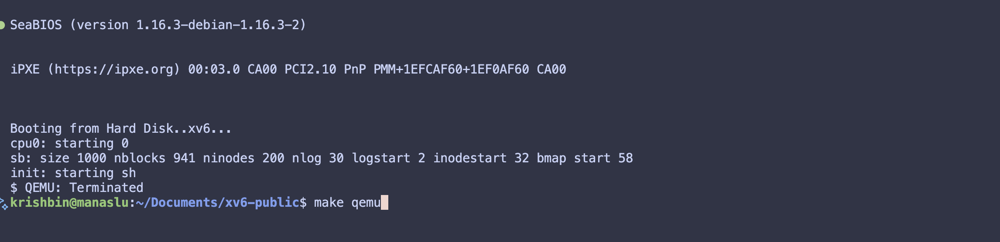

- Task1
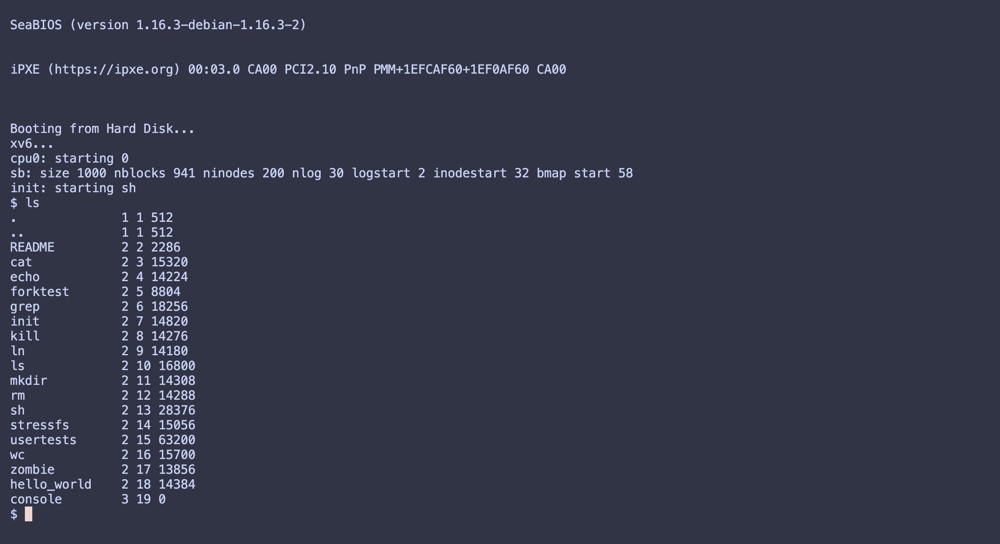
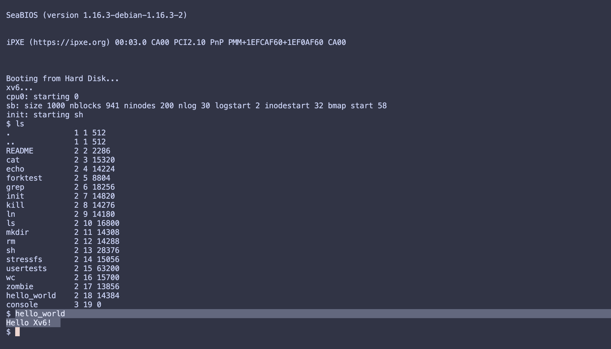

- Task2
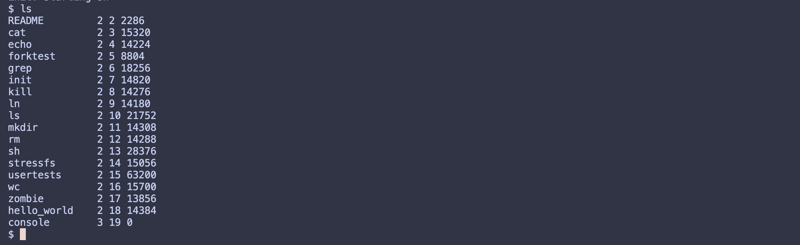
hidden dotfiles
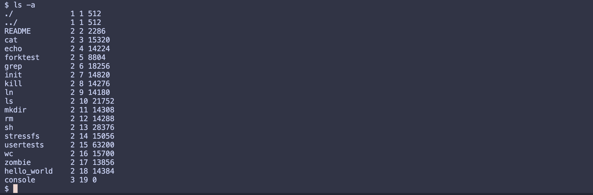
sorting by size
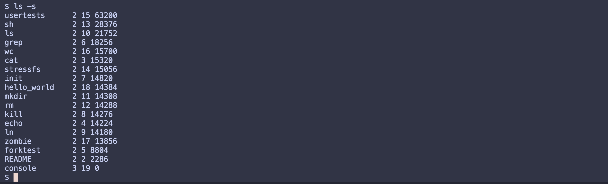
testing ls in the filesystem
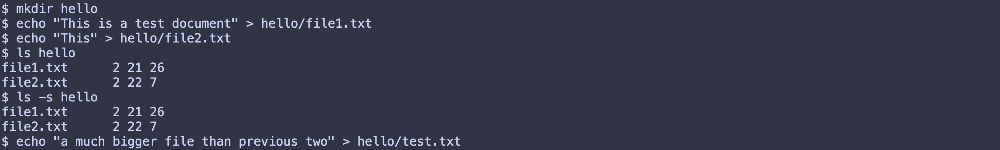
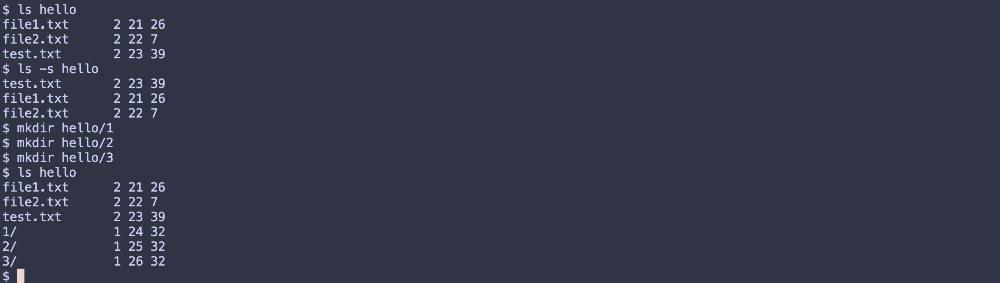

- Task3
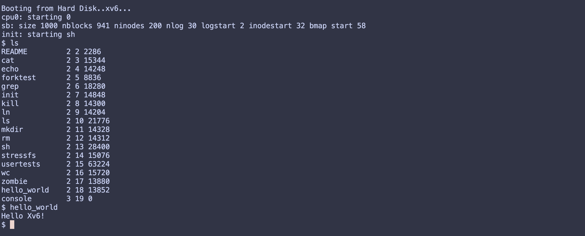

- Task4
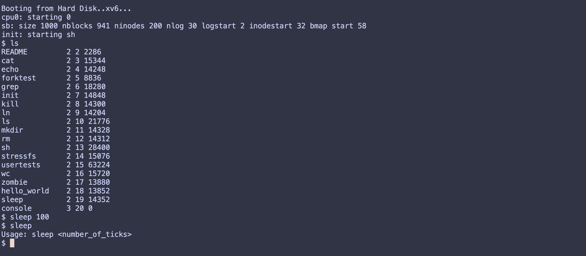

### AI Used
- Explain hello mapping to kernel space
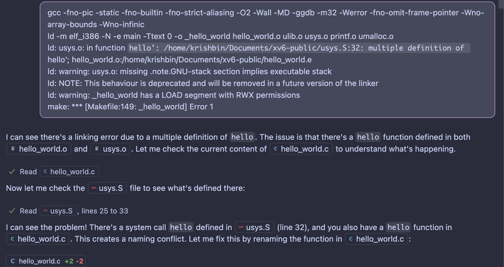

- Cprintf vs printf in xv6 (usermode calls vs kernel mode calls)
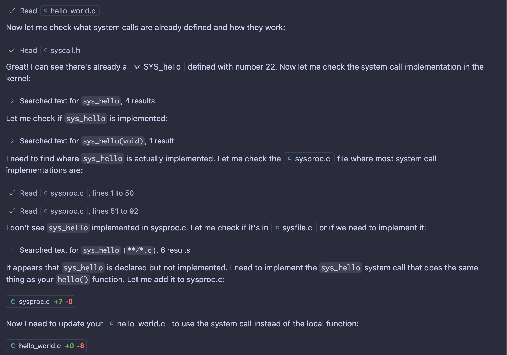